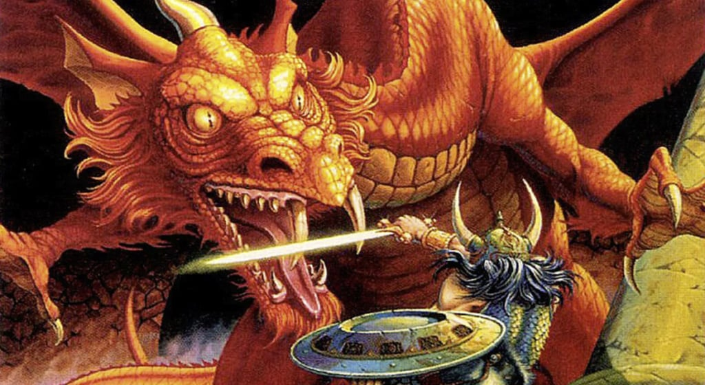

# DOOnjon&Dragon Project

<div>

</div>

C'est un jeu de Dungeon Crawler où les joueurs incarnent des personnages affrontant des monstres dans plusieurs donjons successifs.


## Caractéristiques du projet :
- doit être réaliser en Java, avec IntelliJ
- avec une logique POO
- et avec un schéma UML pour visualiser l'ensemble des classes 

Projet d'étude - 1ère année BUT Info, encadré par des enseignants et codé dans un cadre scolaire.

Le jeu à dû être réaliser en 5 semaines et en binôme.

## Statut du projet

Certaines fonctionalités ne sont pas encore implémentés mais le jeu est fonctionnel.


# Comment jouer

### Cloner le depot sur sa machine:

```bash
    git clone https://github.com/OlivierDumay/POOnjon-et-Dragon.git
```
Sur un framework, comme IntelliJ:
- Chercher le fichier src/Main
- Cliquez sur "Run"
- Jouer dans le terminal intégrer


### Compilation manuelle: 

Installer Java sur sa machine (jdk)

- Ouvrir un terminal et se placer dans le dossier POOjon-et-Dragon/

- Compiler: 
```java
mkdir -p bin
javac -d bin src/Main.java src/dnd/*.java
```
- Executer: 
```java
java -cp bin Main
```


